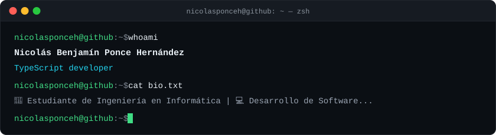
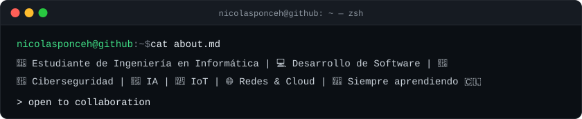

<div align="center">


<br>


</div>

<div align="center">



<br>



</div>


## 🚀 Sobre mí

Soy estudiante de **Ingeniería en Informática** apasionado por el desarrollo de software y la creación de soluciones innovadoras utilizando tecnologías modernas.

Actualmente trabajo en proyectos relacionados con:

- 🤖 Inteligencia Artificial
- 📡 Internet de las Cosas (IoT)
- 📱 Desarrollo de Aplicaciones Móviles
- 🌐 Desarrollo Web Full Stack
- ☁️ Cloud Computing
- 🧠 Arquitectura de Software
- 📊 Sistemas de Información

Mi objetivo es convertirme en un **Software Engineer**, desarrollando aplicaciones escalables y productos tecnológicos que generen un impacto positivo.

<div align="center">

📍 **Arica, Chile** &nbsp;•&nbsp; 🎓 Ingeniería en Informática &nbsp;•&nbsp; 🚀 Open to new opportunities

</div>


## ⚙️ Stack Tecnológico

<div align="center">

**Lenguajes**
<br>


**Frontend**
<br>


**Backend**
<br>


**Mobile**
<br>


**Bases de Datos**
<br>


**Herramientas**
<br>


</div>


## 🚧 Actualmente

```text
🏪 Desarrollando LocalPOS, un sistema POS inteligente para pequeños negocios.
🐶 Mejorando el ecosistema PetGuard.
📚 Aprendiendo Spring Boot, arquitectura de software y buenas prácticas.
🚀 Construyendo un portafolio enfocado en proyectos reales.
```


## 🌟 Proyectos Destacados

### 🐶 PetGuard

Sistema inteligente para el monitoreo de la salud de mascotas mediante IoT, aplicación móvil y dashboard de monitoreo.
`Flutter` `Supabase` `TypeScript` `Next.js` `IoT`
🔗 https://github.com/NicolasPonceH/PetGuardApp

### 🌴 TuriArica

Plataforma web para promover el turismo en la ciudad de Arica con una experiencia moderna y accesible.
`JavaScript` `HTML` `CSS` `Leaflet`
🔗 https://github.com/NicolasPonceH/TuriArica

### 🧠 BioBalance

Proyecto enfocado en bienestar y salud mediante tecnologías web modernas.
`Vue.js`
🔗 https://github.com/NicolasPonceH/BioBalance

**🏢 Landing Page - J2N Software**

Landing Page corporativa con animaciones avanzadas y diseño premium.
`Next.js` `TypeScript` `Tailwind CSS` `Framer Motion`
🔗 Repo: https://github.com/NicolasPonceH/LandingPage_J2N_Software
🌐 Demo: https://j2nsoftware.netlify.app/

**🐾 Landing Page - PetGuard**

Landing Page interactiva del ecosistema PetGuard.
`Next.js` `React` `TypeScript` `Tailwind CSS` `Framer Motion`
🔗 Repo: https://github.com/NicolasPonceH/LandingPage_PetGuard
🌐 Demo: https://petguardpage.netlify.app/

### ☁️ Abis_SUPA

Sistema ABIS - variante cloud (Supabase + GitHub Actions).
`JavaScript` `Supabase` `GitHub Actions`
🔗 https://github.com/NicolasPonceH/Abis_SUPA

### 🏎️ Arica Drag Management System

Sistema de gestión integral para competencias de Drag Racing: digitaliza el registro de pilotos, vehículos, categorías, grillas, tiempos y resultados de eventos de 201 y 402 metros.
`HTML`
🔗 https://github.com/NicolasPonceH/DragManagementSystem


## 📊 GitHub Analytics

<div align="center">


</div>

<!--START_SECTION:waka-->
<!--END_SECTION:waka-->


## 👾 Contribuciones (Space Invaders)

<div align="center">

<picture>
  <source media="(prefers-color-scheme: dark)" srcset="https://raw.githubusercontent.com/NicolasPonceH/NicolasPonceH/output/commit-invaders-dark.svg" />
  <source media="(prefers-color-scheme: light)" srcset="https://raw.githubusercontent.com/NicolasPonceH/NicolasPonceH/output/commit-invaders.svg" />
  
</picture>

</div>


## 🎯 Objetivos

- 🚀 Desarrollar software con impacto real.
- 🤖 Especializarme en Inteligencia Artificial.
- 📱 Crear aplicaciones móviles escalables.
- ☁️ Aprender arquitecturas cloud modernas.
- 💼 Realizar mi práctica profesional como Software Developer.
- 🌎 Contribuir a proyectos Open Source.

## 📖 Actualmente aprendiendo

`Spring Boot` `Arquitectura Hexagonal` `Clean Architecture` `Docker` `PostgreSQL` `Supabase` `Inteligencia Artificial` `Full Stack`


<div align="center">

### 💡 *"La tecnología tiene más valor cuando resuelve problemas reales."*

</div>


## 📫 Contacto

<div align="center">
<a href="https://github.com/NicolasPonceH">

</a>
<a href="mailto:poncenicolas8981@gmail.com">

</a>
</div>


